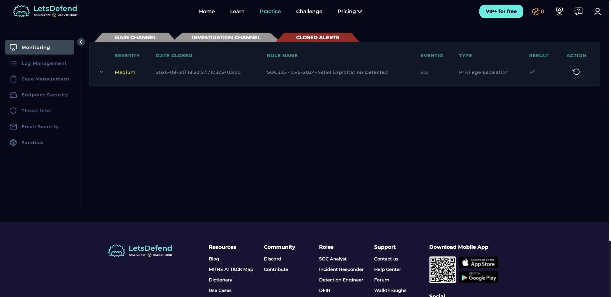
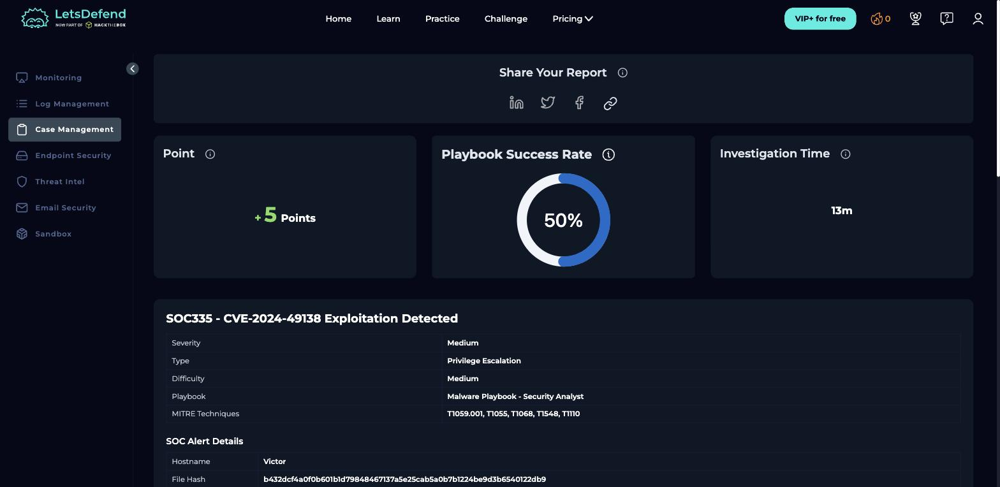
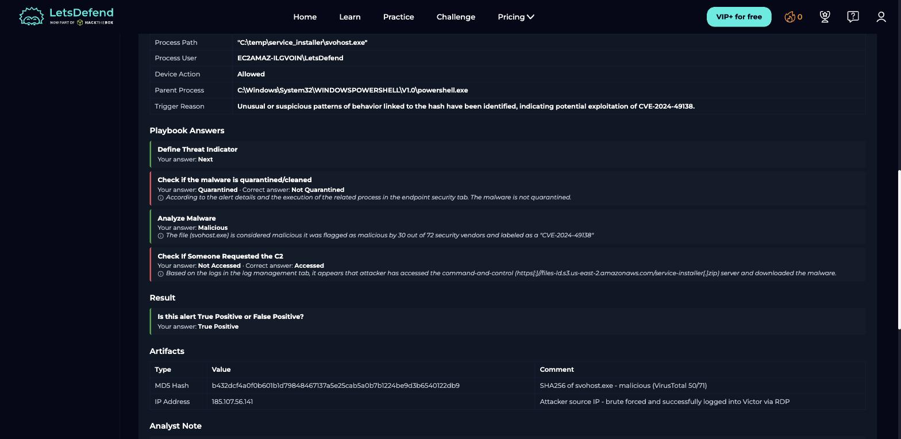
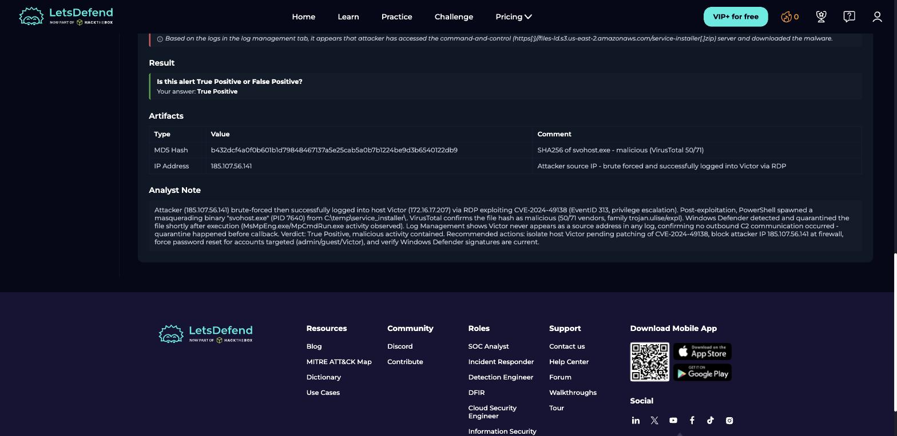
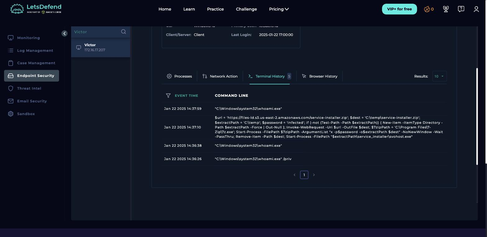

# SOC Alert Triage & Log Analysis Project

## 🎯 Objective
Practice a core SOC L1 skill: investigate real security alerts in a SIEM/EDR environment, analyse the underlying logs and indicators, and document findings the way a real analyst would report them to their team lead.

## 🛠️ Platform
- **[LetsDefend](https://letsdefend.io/)** (free tier) — a browser-based blue team training platform used by SOC training programs worldwide. Provides a real SIEM/EDR-style dashboard with live alerts to investigate, without needing to deploy any infrastructure locally.

## 📋 Steps
1. Create a free account at letsdefend.io.
2. Explore the Monitoring page / SOC dashboard to get familiar with the interface (alert queue, log viewer, case management).
3. Pick 2–3 free alerts and investigate each one:
   - What triggered the alert?
   - What do the related logs / endpoint data show?
   - Is it a true positive or false positive?
   - What IOCs (IPs, hashes, domains) are involved?
4. For each investigated alert, write it up as a mini incident report (see docs/SETUP_GUIDE.md for the template).
5. Take screenshots of the dashboard and your investigation steps.
6. Document overall findings and lessons learnt below.

See [docs/SETUP_GUIDE.md](docs/SETUP_GUIDE.md) for the full step-by-step walkthrough.

## 🔍 Findings

### Alert: SOC335 — CVE-2024-49138 Exploitation Detected (Privilege Escalation)

| Field | Value |
|---|---|
| Host | Victor (172.16.17.207), Windows 10 |
| Severity | Medium |
| Alert type | Privilege Escalation |
| Verdict | **True Positive** |

**Attack chain reconstructed from logs:**

1. **Initial Access (Brute Force → RDP)** — external IP `185.107.56.141` sent repeated failed logon attempts against `admin` and `guest` accounts (Event ID 4625), then successfully authenticated as user `Victor` via RDP (Event ID 4624, Logon Type 10 – RemoteInteractive).
2. **Discovery** — attacker ran `whoami` and `whoami /priv` from a terminal session to enumerate the current user's privileges.
3. **Ingress Tool Transfer** — a PowerShell one-liner downloaded a password-protected archive (`service-installer.zip`) from an S3-hosted staging server (`https://files-ld.s3.us-east-2.amazonaws.com/service-installer.zip`), extracted it with 7-Zip using a hardcoded password, then launched the payload — all found in **Endpoint Security → Terminal History**, not the general network logs.
4. **Execution / Masquerading** — the payload, `svohost.exe` (note the swapped letters — mimicking the legitimate Windows `svchost.exe`, MITRE **T1036**), ran from `C:\temp\service_installer\` as a child process of `powershell.exe` (PID 7640), and was **allowed to run** (not blocked/quarantined by the endpoint agent).
5. **Impact** — process behaviour matched patterns associated with exploitation of **CVE-2024-49138**, a Windows privilege-escalation vulnerability.

**IOCs collected:**
- File hash (SHA256): `b432dcf4a0f0b601b1d79848467137a5e25cab5a0b7b1224be9d3b6540122db9` — confirmed **malicious** on VirusTotal (50/71 vendors flagged it, family `trojan.ulise/expl`)
- Attacker IP: `185.107.56.141`
- Malware staging URL: `https://files-ld.s3.us-east-2.amazonaws.com/service-installer.zip`

**MITRE ATT&CK:** T1110 (Brute Force) · T1059.001 (PowerShell) · T1105 (Ingress Tool Transfer) · T1036 (Masquerading) · T1068 (Privilege Escalation via exploit) · T1548 (Abuse Elevation Control Mechanism)

**Recommended actions:** isolate host Victor, patch CVE-2024-49138, block the attacker IP at the firewall, force a password reset on the targeted local accounts, and verify the endpoint agent's detection/blocking policy is actually enforcing on this host.

*(2 more alerts to be added here as they're investigated — free-tier LetsDefend limits how many alerts can be claimed per day.)*

## 📸 Screenshots

| | |
|---|---|
|  | Alert marked closed (✓ True Positive) in the Closed Alerts queue after investigation. |
|  | Case summary — playbook success rate, investigation time, and MITRE techniques triggered. |
|  | Guided playbook Q&A, including where my initial verdict was corrected against the platform's ground truth. |
|  | IOCs logged as case artifacts, plus my full analyst note documenting the incident timeline and recommended actions. |
|  | Endpoint Security → Terminal History showing the PowerShell command that downloaded and executed the malware — the evidence I initially missed on my first pass. |

## 📚 Lessons Learnt

This investigation scored a **50% playbook success rate** on the first pass — I'm documenting the mistakes honestly because catching and correcting them is the actual skill being practiced:

1. **"Is the malware quarantined?"** — I answered *Quarantined*, assuming a modern endpoint agent would auto-block a file already flagged as malicious. The correct answer was *Not Quarantined*: the alert details and the process log both show `Device Action: Allowed` — the process ran. **Lesson:** never assume a control worked; check the actual log field that states the action taken.
2. **"Did anyone access the C2?"** — I answered *Not Accessed* after searching Log Management for the host's IP as a source/destination address and finding only inbound RDP events. The correct answer was *Accessed* — the evidence was sitting in a completely different data source: **Endpoint Security → Terminal History**, which showed the exact PowerShell command downloading the payload from the C2/staging URL. **Lesson:** "no results in one log source" is not the same as "no evidence exists." A real investigation has to check network logs, process logs, *and* terminal/command history before concluding an activity didn't happen.
3. Despite the two wrong answers, the final verdict (**True Positive**) was correct, and the two mistakes didn't change the overall triage outcome — but they would matter in a real incident (e.g. wrongly assuming the malware was already contained could delay actual remediation). Slowing down to check the endpoint's declared action, not just infer it from context, is the concrete habit I'm taking from this into the next alert.
